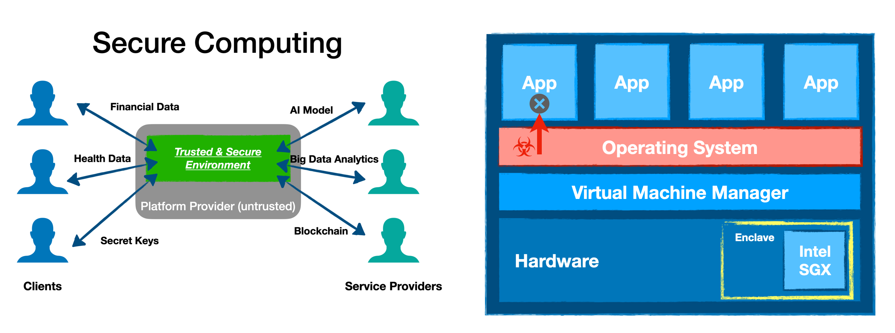
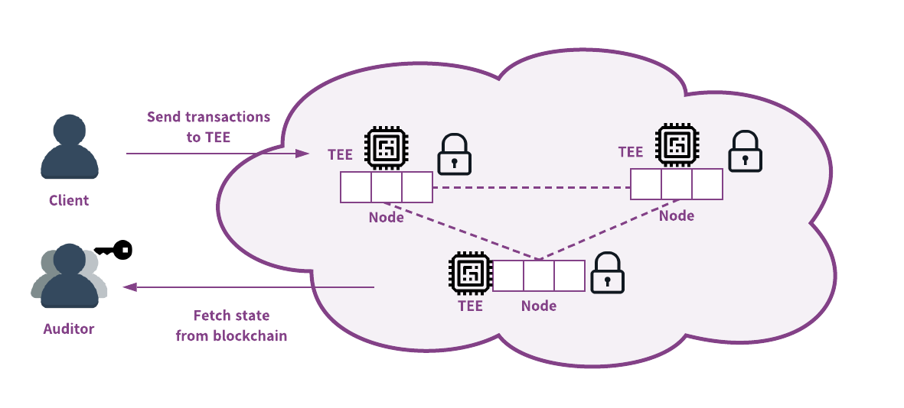

[English](/blog/2020-12-09-teaclave-ecosystem/) | [中文](/blog/2020-12-04-teaclave-ecosystem-cn/)

Apache Teaclave™ (incubating) is an open source universal secure computing
platform, making computation on privacy-sensitive data safe and simple. With
hardware-based security capabilities (e.g., Intel SGX), Teaclave enables
sensitive data to be circulated and processed under security control, even in
off-site and offshore environments, without being compromised or misused. By
providing muti-party interfaces, Teaclave can help to "bridge the data islands"
within/among organizations and companies.

## Highlights

In a nutshell, Teaclave have these four highlights:

- **Secure and Attestable**: Teaclave adopts multiple security technologies to
  enable secure computing, in particular, Teaclave uses Intel SGX to serve the
  most security-sensitive tasks with hardware-based isolation, memory encryption
  and attestation. Also, Teaclave is written in Rust to prevent memory-safety
  issues.
- **Function-as-a-Service**: Teaclave is a function-as-a-service platform
  supports tasks like privacy-preserving machine learning, private set
  intersection, and crypto computation. In addition, developers can also write
  and execute Python function. Teaclave supports both general secure computing
  tasks and flexible multi-party secure computation.
- **Ease of Use**: Teaclave builds its components in containers, therefore, it
  supports deployment both locally and within cloud infrastructures. Teaclave
  also provides convenient endpoint APIs, client SDKs and command line tools.
- **Flexibility**: Components in Teaclave are designed in modular, and some like
  remote attestation can be easily embedded in other projects. In addition,
  Teaclave SGX SDK can also be used separately to write standalone SGX enclaves
  for other purposes.

## **Teaclave Ecosystem**

Teaclave provides an open ecosystem in the Apache Way to various parties like
project developers, platform users, service providers, first/third-party library
users. In a border view, the Teaclave community aims to support commercial
products, academic research projects, teaching platform, and other open source
projects powered by Teaclave.

Due to the importance of porting, maintaining, auditing of third-party libraries
in the trusted computing environments, we maintains hundreds of Rust's libraries
for TEE, e.g., crypto, scientific computation, and machine learning libraries.
With these libraries around the Teaclave ecosystem, this drives the development
of other projects powered by Teaclave. Furthermore, we are also incubating many
important TEE components like [MesaPy for SGX](https://github.com/mesalock-linux/mesapy/tree/sgx),
and [Rust OP-TEE TrustZone SDK]((https://github.com/sccommunity/rust-optee-trustzone-sdk).

The Teaclave open-source ecosystem is also supporting many commercial products.
For example, Baidu, as a platform service provider, has announced the
[MesaTEE](https://anquan.baidu.com/product/mesatee)
secure computing platform, providing a secure, efficient, and extensible secure
computing solution to help companies and organizations for privacy-preserving
data exchange/computation.

In addition, the Teaclave ecosystem is also actively sponsoring academic
research in trusted execution environment and system security like topics about
security in TEE, designing of memory-safe SGX SDK, security of supply chains,
etc. Many studies has been published in top-tier conferences.

## Projects powered by Teaclave

Because of the openness and flexibility of Teaclave, many projects are based on
the Teaclave platforms and Teaclave SGX SDK. Here, we summarize several popular
open source or commercial products powered by Teaclave. We hope more
organizations and companies can come and join the ecosystem, pushing forward the
boundary of data privacy and secure computation.

  - [Advanca](https://github.com/advanca/advanca): A privacy-preserving
    general-purpose compute/storage infrastructure for Dapps.
  - [Anonify](https://github.com/LayerXcom/anonify): A blockchain-agnostic
    execution environment with privacy and auditability based on TEE.

  - [Enigma Core](https://github.com/enigmampc/enigma-core): Enigma Core
    library. The domain: Trusted and Untrusted App in Rust.
  - [Crypto.com Chain](https://github.com/crypto-com/chain): Alpha version
    prototype of Crypto.com Chain.
  - [Occlum](https://github.com/occlum/occlum): Occlum is a memory-safe,
    multi-process library OS for Intel SGX. This project plans to join the
    Confidential Computing Consortium in the near future.
  - [Phala Network](https://github.com/Phala-Network/phala-blockchain):
    A TEE-Blockchain hybrid architecture implementing Confidential Contract on
    Polkadot.
  - [SafeTrace](https://github.com/enigmampc/SafeTrace): Privacy preserving
    voluntary COVID-19 self-reporting platform for contact tracing.
  - [Secret Network](https://github.com/enigmampc/SecretNetwork): A
    blockchain-based, open-source protocol that lets anyone perform computations
    on encrypted data, bringing privacy to smart contracts and public

    blockchains.
  - [substraTEE](https://github.com/scs/substraTEE): Trusted Off-Chain Compute
    Framework for substrate blockchains.
  - [Veracruz](https://github.com/veracruz-project/veracruz): Veracruz is a
    framework for defining and deploying collaborative, privacy-preserving
    computations amongst a group of mutually mistrusting individuals.
  This project plans to join the Confidiential Computing Consortium in the near future.

In summary, all above projects are trying to utilize capabilities from TEE, like
hardware-isolation, memory encryption and remote attestation, to protect data
computation or serve as trusted party.
Based on Teaclave SGX SDK, some projects like Occlum and Veracruz aim to provide a more flexible TEE
framework. Others like Secret Network and substraTEE want to implement a trusted
node for their business logics. Also, some projects are using some common
components like remote attestation libraries in their code base. Overall, the
Teaclave ecosystem has empowered lots of successful projects. We have a list of
projects powered by Teaclave in the community homepage.

At last, everyone are very welcome to join the Teaclave community and contribute
to the secure computing ecosystem. Hope to see more users and contributors in
the Teaclave community. BTW, if there are any other amazing projects I didn't
mention you plan to work on, please also share with me. I'm more than happy to
learn more about it.
