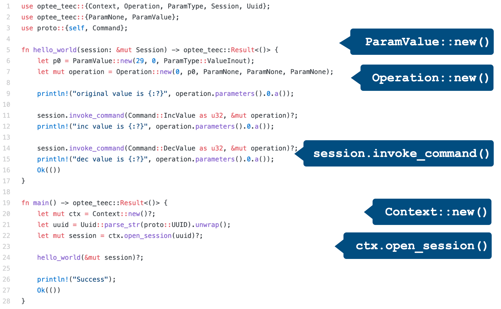
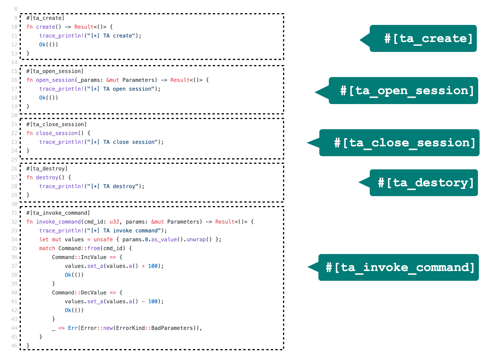
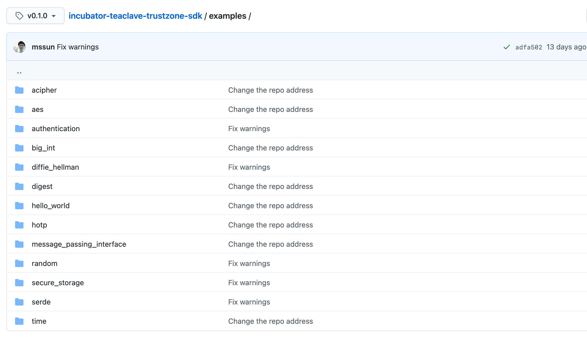

On behalf of the Teaclave community, I am happy to announce the release of
Teaclave TrustZone SDK 0.1.0. This is the first Apache Incubator release since
the recent donation to the Teaclave community.

Teaclave TrustZone SDK provides abilities to build safe TrustZone applications
in Rust. The SDK is based on the OP-TEE project which follows GlobalPlatform TEE
specifications and provides ergonomic APIs. In addition, it enables capability
to write TrustZone applications with Rust's standard library and many
third-party libraries (i.e., crates). Teaclave TrustZone SDK is a sub-project of
Apache Teaclave™ (incubating). To learn more about the design and history of
TrustZone SDK,
please read the blog [Welcome Rust OP-TEE TrustZone SDK To Teaclave](https://teaclave.apache.org/blog/2021-03-14-welcome-rust-optee-trustzone-sdk/).

## Highlights

This version implements the following Rust APIs in GlobalPlatform TEE
specifications:

**TEE Client API** (`optee-teec`)
- Context
- Error
- Operation
- Parameter
- Session
- UUID

**TEE Internal Core API** (`optee-utee`)
- Arithmetical
- Crypto Operation
- Error
- Object
- Parameter
- Time
- Trace

Here is a demonstration of using these Rust APIs to open a session and invoke a
function to TA.



We also provides procedure macros to automatically generate bindings interfaces of TA:
- `#[ta_create]`, `#[ta_destroy]`, `#[ta_open_session]`, `#[ta_close_session]`, `#[ta_invoke_command]`

These annotations will automatically generate helper functions to bridge the normal/secure worlds.



This version includes rewrites of all examples (e.g., AES, authentication, big
integer, HOTP) from OP-TEE repository. In addition, we include more examples
using `serde` for serialization and deserialization.



This version is compatible with OP-TEE 3.13.0.

## Getting Started

Here is a simple instruction to download, build and test the TrustZone SDK:

```
$ wget https://dist.apache.org/repos/dist/dev/incubator/teaclave/trustzone-sdk-0.1.0-rc.1/apache-teaclave-trustzone-sdk-0.1.0-rc.1-incubating.tar.gz
$ tar zxvf apache-teaclave-trustzone-sdk-0.1.0-rc.1-incubating.tar.gz && cd
apache-teaclave-trustzone-sdk-0.1.0-incubating

$ # Instructions to verify the source tar:
https://teaclave.apache.org/download/#verify-the-integrity-of-the-files

$ # Building
$ docker run --rm -it -v$(pwd):/teaclave-trustzone-sdk -w
/teaclave-trustzone-sdk teaclave/teaclave-trustzone-sdk-build:0.1.1
bash -c "source environment && make"

$ # Testing
$ docker run --rm -it -v$(pwd):/teaclave-trustzone-sdk -w
/teaclave-trustzone-sdk teaclave/teaclave-trustzone-sdk-build:0.1.1
bash -c "source environment && cd ci && ./ci.sh"
```

We also provide a document [Getting Started with OP-TEE for QEMU
ARMv8](https://teaclave.apache.org/trustzone-sdk-docs/getting-started-with-optee-for-qemu-armv8/)
to get started step by step.

## Download

You can download the release from the
[download](https://teaclave.apache.org/download/) page. Also, please checkout
our [repository](https://github.com/apache/incubator-teaclave-trustzone-sdk)
hosted on GitHub.

## Contributing

Teaclave TrustZone SDK is under the Apache License v2 and open source in The
Apache Way. We aim to create a project that is maintained and owned by the
community. All kinds of contributions are welcome. Thanks to our contributors.
