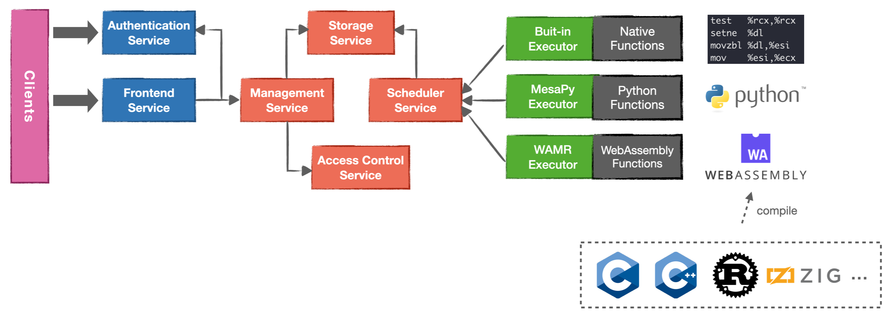
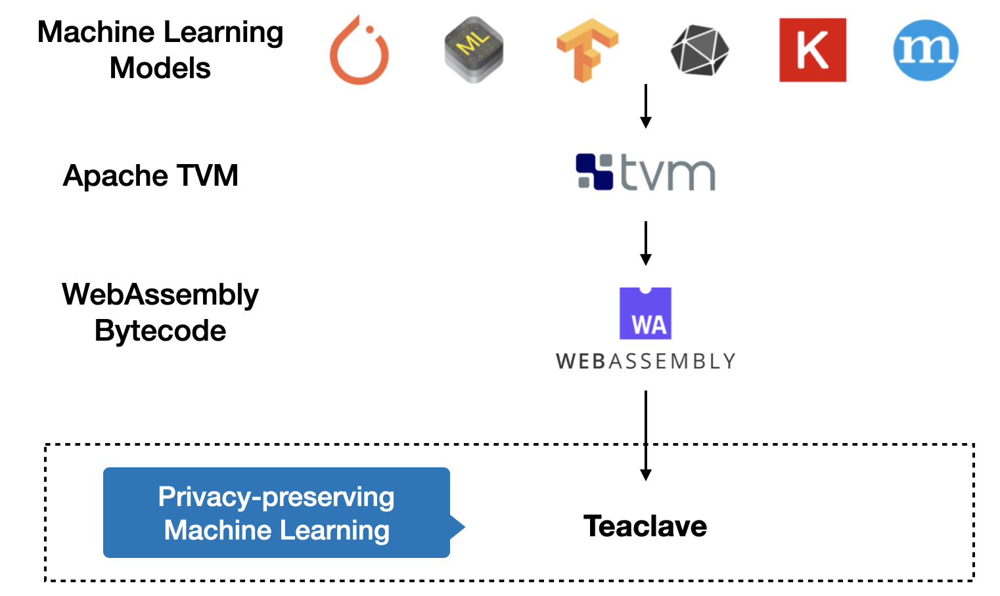

On behalf of the Teaclave community, I am happy to announce the *third* Apache
Incubator release of Teaclave, 0.3.0. Teaclave is a universal secure computing
platform, making computation on privacy-sensitive data safe and simple.
Apache Teaclave™ (including the
[FaaS platform](https://github.com/apache/incubator-teaclave),
[SGX SDK](https://github.com/apache/incubator-teaclave-sgx-sdk),
and [TrustZone SDK](https://github.com/apache/incubator-teaclave-trustzone-sdk)) is
being used and contributed by developers from many organizations and
other open source projects. Please see the [*powered by*](/powered-by) page to learn more.

This is the third official Apache Incubator release. In this release, we focus
more on bringing [WebAssembly](https://webassembly.org/) into Teaclave. Now, you
can run functions written in different languages in Teaclave with the
WebAssembly executor. Specifically, we modify
[WebAssembly Micro Runtime](https://github.com/bytecodealliance/wasm-micro-runtime) and add
it as a new executor in Teaclave.

## Highlights

In this release, we added a new WebAssembly executor which supports to run
function in the WebAssembly bytecode. Therefore, in addition to native code and
Python scripts, Teaclave can run many other languages which can be compiled in
to WebAssembly. This enables a lot of functions of privacy-preseving computation
that are not easily rewritten in Rust or Python. Furthermore, because of the
ecosystem of WebAssembly, we can even run deep neural network models in the
WebAssembly executor.



To illustrate the capability of the executor, we also support WebAssembly
machine learning models compiled by [Apache TVM](https://tvm.apache.org/).
Apache TVM is an open source machine learning compiler framework for CPUs, GPUs,
and machine learning accelerators. TVM also supports WebAssembly runtime
backend. We also introduce a new MNIST inference example to show the usage of
the new executor with TVM.



## 0.3.0 Release Notes

Here is a list of notable changes in Teaclave version 0.3.0.

**Features**

  - Add the WebAssembly executor to support functions written in other languages.
  - Examples of running C and Rust with the WebAssembly executor.
  - Support inference tasks with models compiled by TVM.
  - Add the MNIST inference example to demonstrate the ability of using TVM in Teaclave.

**Enhancements**

  - Add the script to simplify developing with editors with Rust's Language Server Protocol support.
  - Upgrade SGX SDK dependencies, i.e., Intel SGX SDK to version 2.14.100.2, DCAP to version 1.11.100.2.

**Bug Fixes**

  - Update the SGX SDK used in the runtime dockerfile.
  - Fix `Python.h` not found when compiling `acs_py_enclave.c`.
  - Fix building system messed up by untracked `Cargo.lock` files.
  - Fix dcap building issue.

**Docs**

  - Add instructions to configure URLs of input/output files in examples.
  - Executing WebAssembly in Teaclave: <https://teaclave.apache.org/docs/executing-wasm/>.
  - Inferencing with TVM in Teaclave: <https://teaclave.apache.org/docs/inference-with-tvm/>.

## Download

Teaclave 0.3.0 can be downloaded at [the download page](/download/). Note that 
it is essential to verify the integrity of the downloaded file using the
PGP signature (the `.asc` file) or a hash (the `.sha256` file).

## Documentation

If it is the first time to try Teaclave, we provide a simple but clear tutorial
to guide you getting stated with Teaclave by invoking
[your first function](/docs/my-first-function/) in Teaclave.

Basically, you can build the Teaclave platform using docker with these commands:

```sh
$ tar zxvf apache-teaclave-0.3.0-incubating.tar.gz && cd \
  apache-teaclave-0.3.0-incubating
$ # Instructions to verify the source tar: https://teaclave.apache.org/download/#verify-the-integrity-of-the-files

$ docker run --rm -v $(pwd):/teaclave -w /teaclave \
  -it teaclave/teaclave-build-ubuntu-1804-sgx-2.14:latest \
   bash -c ". /root/.cargo/env && \
     . /opt/sgxsdk/environment && \
     mkdir -p build && cd build && \
     cmake -DTEST_MODE=ON -DSGX_SIM_MODE=ON -DGIT_SUBMODULE=OFF .. && \
     make"
```

Launch all services with `docker-compose` using simulation mode:

```sh
$ (cd docker && docker-compose -f docker-compose-ubuntu-1804-sgx-sim-mode.yml up --build)
```

And invoke function with a Python client:

```sh
$ cd examples/python
$ PYTHONPATH=../../sdk/python python3 builtin_echo.py 'Hello, Teaclave!'
[+] registering user
[+] login
[+] registering function
[+] creating task
[+] approving task
[+] invoking task
[+] getting result
[+] done
[+] function return:  b'Hello, Teaclave!'
```

If you want to understand the internals of Teaclave, we provide several
documents about the [design](/docs/#design) of Teaclave. Also, we extensively
document our [codebase](/docs/#codebase) in each sub directories. At last, [API references](/docs/#api-references)
are automatically generated and uploaded to our homepage.

## Community

- Join us on our [mailing list](https://lists.apache.org/list.html?dev@teaclave.apache.org) and [Discord channel](https://discord.gg/ynECXsxm5P).
- Follow us at [@ApacheTeaclave](https://twitter.com/ApacheTeaclave).
- Meet us at our [monthly community meetup](https://teaclave.apache.org/community/#calendar).
- See [more](https://teaclave.apache.org/community/).
